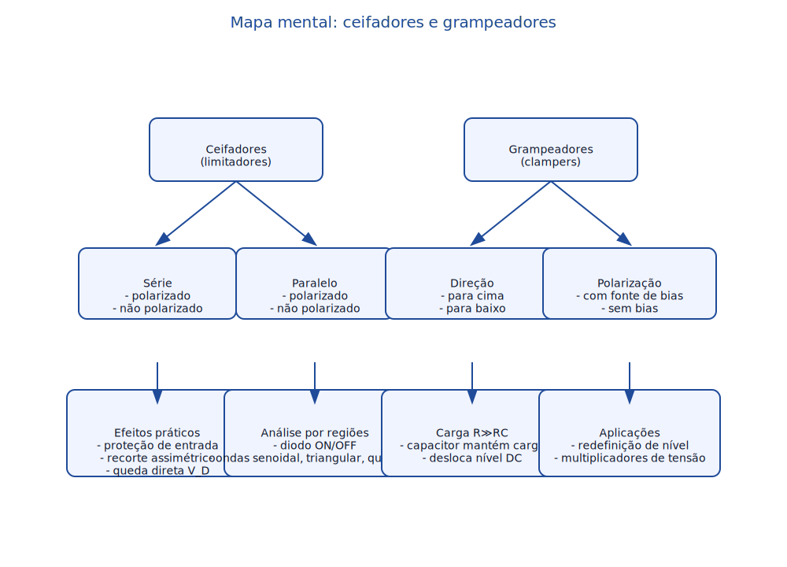

# Resumo de ceifadores e grampeadores

## Resumo
- **Ceifadores em série** inserem o diodo no caminho do sinal, deixando a saída seguir a entrada enquanto ele está cortado e impondo uma transição quando a tensão de entrada atinge o nível de condução. A adição de uma fonte de polarização permite deslocar o ponto de transição para níveis diferentes de 0 V, garantindo corte ou passagem apenas após o somatório do sinal com a referência exceder a queda direta do diodo.
- **Ceifadores em paralelo** conectam o diodo entre o sinal e uma referência, drenando a corrente sempre que o sinal tenta ultrapassar o nível de condução. Quando polarizados, fixam a tensão de saída em torno da soma da referência e da queda direta; sem polarização, limitam aproximadamente a ±0,7 V (diodo de silício idealizado).
- **Efeitos práticos**: a análise cobre o limite ideal (V_D = 0 V) e o de silício (V_D ≈ 0,7 V), além de ondas triangulares ou quadradas. A definição das regiões de condução usa Leis de Kirchhoff e superposição entre a fonte de entrada e a fonte de polarização. Os exemplos do capítulo mostram como traçar a forma de onda resultante por segmentos, marcando os tempos em que o diodo comuta.
- **Grampeadores (clampers)** introduzem um capacitor em série com o sinal e um diodo para carregar o capacitor com a tensão de referência durante uma semiciclo. No semiciclo seguinte, o capacitor mantém a carga (por R≫RC) e desloca todo o sinal para cima ou para baixo. A versão polarizada adiciona uma fonte em série ao diodo para fixar o deslocamento DC, enquanto a não polarizada depende apenas da tensão aplicada e da queda no diodo.

## Mapa mental (texto)
- **Ceifadores**
  - Série
    - Não polarizado: corte em ~0,7 V (Si)
    - Polarizado: corte em V_ref + V_D
  - Paralelo
    - Não polarizado: grampeia ±0,7 V
    - Polarizado: grampeia em V_ref ± V_D
  - Exemplos típicos
    - Entrada senoidal/triangular/quadrada
    - Análise por regiões (diodo ligado/desligado)
- **Grampeadores (clampers)**
  - Estrutura: capacitor + diodo + resistor de carga (R≫RC)
  - Direção
    - Para cima (levanta nível DC)
    - Para baixo (abaixa nível DC)
  - Polarização
    - Não polarizado: deslocamento ≈ V_pico − V_D
    - Polarizado: deslocamento ajustado pela fonte auxiliar
  - Aplicações: redefinição de nível DC, multiplicadores de tensão

## Mapa mental (imagem gerada em Python)

## Exemplos do livro (Cap. 2)
- **Exemplo 2.18**: ceifador em série com fonte de polarização; a forma de onda triangular de entrada é traçada até o ponto em que a soma com a fonte faz o diodo conduzir, fixando um patamar de saída e alterando o valor médio.
- **Exemplo 2.19**: ceifador em paralelo submetido a sinal quadrado; a saída é grampeada ao nível de referência quando o diodo conduz e segue a entrada quando o diodo está aberto, definindo limites assimétricos para os semiciclos.
- **Exemplo 2.20**: repete a análise anterior usando o método de determinar o nível de transição (tensão de corte) e o seguimento da entrada na região de corte, reforçando o procedimento passo a passo.
- **Exemplo 2.21**: reavalia o Exemplo 2.20 considerando V_D ≈ 0,7 V para um diodo de silício, mostrando a redução dos patamares de clipe em comparação com o modelo ideal.
- **Exemplo 2.22**: grampeador com carga resistiva grande (R ≫ RC); durante a metade do período o diodo conduz e o capacitor carrega, e na metade seguinte o capacitor desloca a onda quadrada de entrada, preservando a forma mas alterando o nível DC.
- **Exemplo 2.23**: repete o Exemplo 2.22 para diodo de silício; a tensão na saída permanece deslocada, porém com leve queda devido à tensão direta do diodo, destacando a diferença entre modelos ideal e real.
